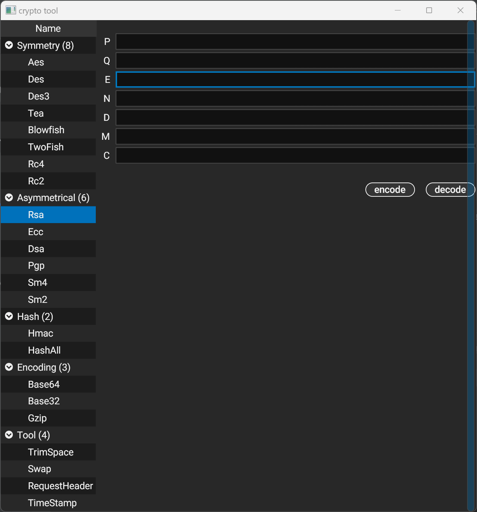

#  crypt
Cryptography synthesis tools



 
how to build ?

```go
1. git clone https://github.com/ddkwork/crypt.git

2. install golang from https://go.dev/dl/

3. install gcc

4. go build -x .
	
5. go run -x .
```